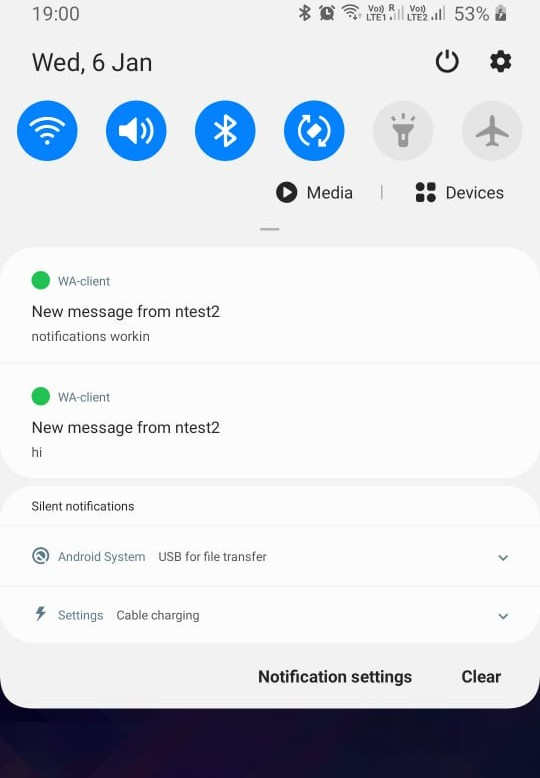

Lite Messenger
======

A lightweight Instant messaging application with both Server(Java) & Client(Android). 

The server program uses MongoDB as a database. Server is implemented using the Java NIO package. It uses Thread Pools to handle requests of multiple clients simultaneously and avoids creating a new thread for every client connection. 

The android client application upon first run asks users to register to the system using phone number. Thereafter user details are stored in the shared preferences and user need not enter phone number again. It uses separate threads for receiving and sending messages. The client application creates a background service which remains connected to the server and triggers notifications when a message is being received while client being closed.


## Features 
* Registration through phone number

* Authentication through unique user token

* Multiple Threads

* Temporary storing of messages

* Time-Stamp

* Read/Receive receipt

* Real-time message notifications.

  

## Future Works
* Group Messaging

* Media Support

  

## Steps to Run

**Start Server**

Ensure that MongoDB database instance is up and running before starting the server

```shell
git clone https://github.com/amankrsingh1812/Lite-Messenger.git
cd Lite-Messenger/messenger_server
bash start_server.sh
```

**Build & Run Android Client**

1. Open the `android_client` project folder in android studios.

2. Set the IP Address of Server in the constructor of `SendRequest` in `ReceivingThread.java`.

3. Build the apk and run it on a suitable android device/emulator keeping the server running.

   

## Android Client Screen-shots

     


